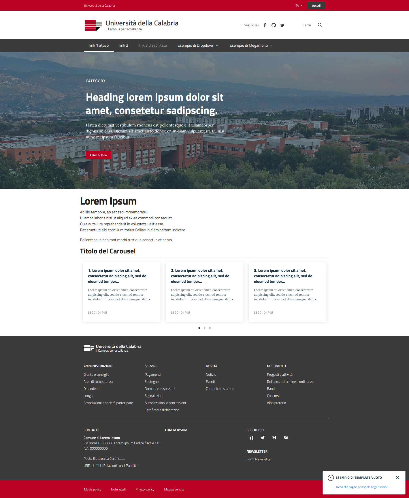

Template Django conforme a linee guida AGID per l'Università della Calabria
---------------------------------------------------------------------------

Template grafico per il framework Python Django, per applicazioni
dell'Univeristà della Calabria, basato sulla libreria
[Bootstrap Italia](https://italia.github.io/bootstrap-italia/).

L'app estende [design-django-theme](https://github.com/italia/design-django-theme).


_**Frontend**: Schermata di default del template_


Requirements
------------

```
design-django-theme
```


Installazione
-------------

```
pip install django-unical-boostrap-italia
```
- In settings.py INSTALLED_APPS inserire *django_unical_bootstrap_italia*.


Utilizzo
--------

```
python manage.py collectstatic
```

- Configurare il file ```base-setup.html``` eseguendo l'overload dei blocchi
principali, al fine di personalizzare le sezioni di interesse;
- Ogni pagina HTML del proprio progetto dovrà estendere ```base-setup.html```
e definire il contenuto del blocco ``````. Header e Footer
saranno sempre ereditati da ```base-setup.html```, a meno di variazioni su
singole pagine.


Stile e CSS
----------------

Il foglio di stile che ridefinisce l'aspetto del tema di default è
```static/css/unical-style.scss```.

Per la compilazione offline del file .scss in .css,  generando l corrispettivo
```unical-style.css```, questi i comandi:

```
python manage.py collectstatic
```

E' sempre possibile integrare fogli di stile o javascript
effettuando l'overload del blocco ``````.


Esempio di base-setup.html
--------------------

```
<!-- Extends default Bootstrap Italia template -->




<!-- Page Title -->

Università della Calabria


<!-- My custom scss sheet -->

<link rel="stylesheet" href="" type="text/css" />


<!-- URL link top left -->

https://www.unical.it


<!-- Name top left -->

Università della Calabria


<!-- Mobile slim_org_name -->

Università della Calabria


<!-- Make empty areas -->



<!-- Logo in Header -->




<!-- Organization name in Header -->

Università della Calabria


<!-- Organization description in Header -->

Il Campus per eccellenza


<!-- Logo in Footer -->




<!-- Organization name in Footer -->

Università della Calabria


<!-- Organization name in Footer -->

Il Campus per eccellenza

```

Esempio di pagine figlie (qui index.html)
-----------------------------------------

```






<div class="it-hero-wrapper it-dark it-overlay">
  <!-- - img-->
  <div class="img-responsive-wrapper">
    <div class="img-responsive">
        <div class="img-wrapper">
            
        </div>
    </div>
  </div>
  <!-- - texts-->
  <div class="container">
    <div class="row">
        <div class="col-12">
          <div class="it-hero-text-wrapper bg-dark">
              <span class="it-category">Category</span>
              <h1 class="no_toc">Heading lorem ipsum dolor sit amet, consetetur sadipscing.</h1>
              <p class="d-none d-lg-block">Platea dictumst vestibulum rhoncus est pellentesque elit ullamcorper dignissim cras. Dictum sit amet justo donec enim diam vulputate ut. Eu nisl nunc mi ipsum faucibus.</p>
              <div class="it-btn-container"><a class="btn btn-sm btn-secondary" href="#">Label button</a></div>
          </div>
        </div>
    </div>
  </div>
</div>


<div class="container my-4">
  <h1>Lorem Ipsum</h1>
  <p>Ab illo tempore, ab est sed immemorabili.<br/>
    Ullamco laboris nisi ut aliquid ex ea commodi consequat.<br/>
    Quis aute iure reprehenderit in voluptate velit esse.<br/>
    Petierunt uti sibi concilium totius Galliae in diem certam indicere.</p>
  <p>Pellentesque habitant morbi tristique senectus et netus.</p>

  <div class="it-carousel-wrapper it-carousel-landscape-abstract-three-cols">
  <div class="it-header-block">
    <div class="it-header-block-title">
      <h2 class="no_toc">Titolo del Carousel</h2>
    </div>
  </div>
  <div class="it-carousel-all owl-carousel it-card-bg">
    <div class="it-single-slide-wrapper">
      <div class="card-wrapper card-space">
        <div class="card card-bg">
          <div class="card-body">
            <h5 class="card-title">1. Lorem ipsum dolor sit amet, consectetur adipiscing elit, sed do eiusmod tempor…</h5>
            <p class="card-text">Lorem ipsum dolor sit amet, consectetur adipiscing elit, sed do eiusmod tempor incididunt ut labore et dolore magna aliqua.</p>
            <a class="read-more" href="#">
              <span class="text">Leggi di più</span>
              <svg class="icon">
                <use xlink:href="#it-arrow-right"></use>
              </svg>
            </a>
          </div>
        </div>
      </div>
    </div>
    <div class="it-single-slide-wrapper">
      <div class="card-wrapper card-space">
        <div class="card card-bg">
          <div class="card-body">
            <h5 class="card-title">2. Lorem ipsum dolor sit amet, consectetur adipiscing elit, sed do eiusmod tempor…</h5>
            <p class="card-text">Lorem ipsum dolor sit amet, consectetur adipiscing elit, sed do eiusmod tempor incididunt ut labore et dolore magna aliqua.</p>
            <a class="read-more" href="#">
              <span class="text">Leggi di più</span>
              <svg class="icon">
                <use xlink:href="#it-arrow-right"></use>
              </svg>
            </a>
          </div>
        </div>
      </div>
    </div>
    <div class="it-single-slide-wrapper">
      <div class="card-wrapper card-space">
        <div class="card card-bg">
          <div class="card-body">
            <h5 class="card-title">3. Lorem ipsum dolor sit amet, consectetur adipiscing elit, sed do eiusmod tempor…</h5>
            <p class="card-text">Lorem ipsum dolor sit amet, consectetur adipiscing elit, sed do eiusmod tempor incididunt ut labore et dolore magna aliqua.</p>
            <a class="read-more" href="#">
              <span class="text">Leggi di più</span>
              <svg class="icon">
                <use xlink:href="#it-arrow-right"></use>
              </svg>
            </a>
          </div>
        </div>
      </div>
    </div>
    <div class="it-single-slide-wrapper">
      <div class="card-wrapper card-space">
        <div class="card card-bg">
          <div class="card-body">
            <h5 class="card-title">4. Lorem ipsum dolor sit amet, consectetur adipiscing elit, sed do eiusmod tempor…</h5>
            <p class="card-text">Lorem ipsum dolor sit amet, consectetur adipiscing elit, sed do eiusmod tempor incididunt ut labore et dolore magna aliqua.</p>
            <a class="read-more" href="#">
              <span class="text">Leggi di più</span>
              <svg class="icon">
                <use xlink:href="#it-arrow-right"></use>
              </svg>
            </a>
          </div>
        </div>
      </div>
    </div>
    <div class="it-single-slide-wrapper">
      <div class="card-wrapper card-space">
        <div class="card card-bg">
          <div class="card-body">
            <h5 class="card-title">4. Lorem ipsum dolor sit amet, consectetur adipiscing elit, sed do eiusmod tempor…</h5>
            <p class="card-text">Lorem ipsum dolor sit amet, consectetur adipiscing elit, sed do eiusmod tempor incididunt ut labore et dolore magna aliqua.</p>
            <a class="read-more" href="#">
              <span class="text">Leggi di più</span>
              <svg class="icon">
                <use xlink:href="#it-arrow-right"></use>
              </svg>
            </a>
          </div>
        </div>
      </div>
    </div>
    <div class="it-single-slide-wrapper">
      <div class="card-wrapper card-space">
        <div class="card card-bg">
          <div class="card-body">
            <h5 class="card-title">4. Lorem ipsum dolor sit amet, consectetur adipiscing elit, sed do eiusmod tempor…</h5>
            <p class="card-text">Lorem ipsum dolor sit amet, consectetur adipiscing elit, sed do eiusmod tempor incididunt ut labore et dolore magna aliqua.</p>
            <a class="read-more" href="#">
              <span class="text">Leggi di più</span>
              <svg class="icon">
                <use xlink:href="#it-arrow-right"></use>
              </svg>
            </a>
          </div>
        </div>
      </div>
    </div>
    <div class="it-single-slide-wrapper">
      <div class="card-wrapper card-space">
        <div class="card card-bg">
          <div class="card-body">
            <h5 class="card-title">4. Lorem ipsum dolor sit amet, consectetur adipiscing elit, sed do eiusmod tempor…</h5>
            <p class="card-text">Lorem ipsum dolor sit amet, consectetur adipiscing elit, sed do eiusmod tempor incididunt ut labore et dolore magna aliqua.</p>
            <a class="read-more" href="#">
              <span class="text">Leggi di più</span>
              <svg class="icon">
                <use xlink:href="#it-arrow-right"></use>
              </svg>
            </a>
          </div>
        </div>
      </div>
    </div>
  </div>
</div>

</div>





<script src=""></script>

<!-- Notification per tornare alla pagina principale -->
<div class="notification dismissable with-icon" role="alert" id="notification-esempi" aria-labelledby="notification-esempi-title">
    <h5 id="notification-esempi-title">
        <svg class="icon">
            <use xlink:href="#it-info-circle"></use>
        </svg>Esempio di template vuoto
    </h5>
    <p>
        <a href="{{ site.baseurl }}/docs/esempi/">Torna alla pagina principale degli esempi</a>
    </p>
    <button type="button" class="btn notification-close">
        <svg class="icon">
            <use xlink:href="#it-close"></use>
        </svg>
        <span class="sr-only">Chiudi notifica: Titolo notification</span>
    </button>
</div>

<script>
$(document).ready(function() {
    notificationShow('notification-esempi');
});
</script>


```
